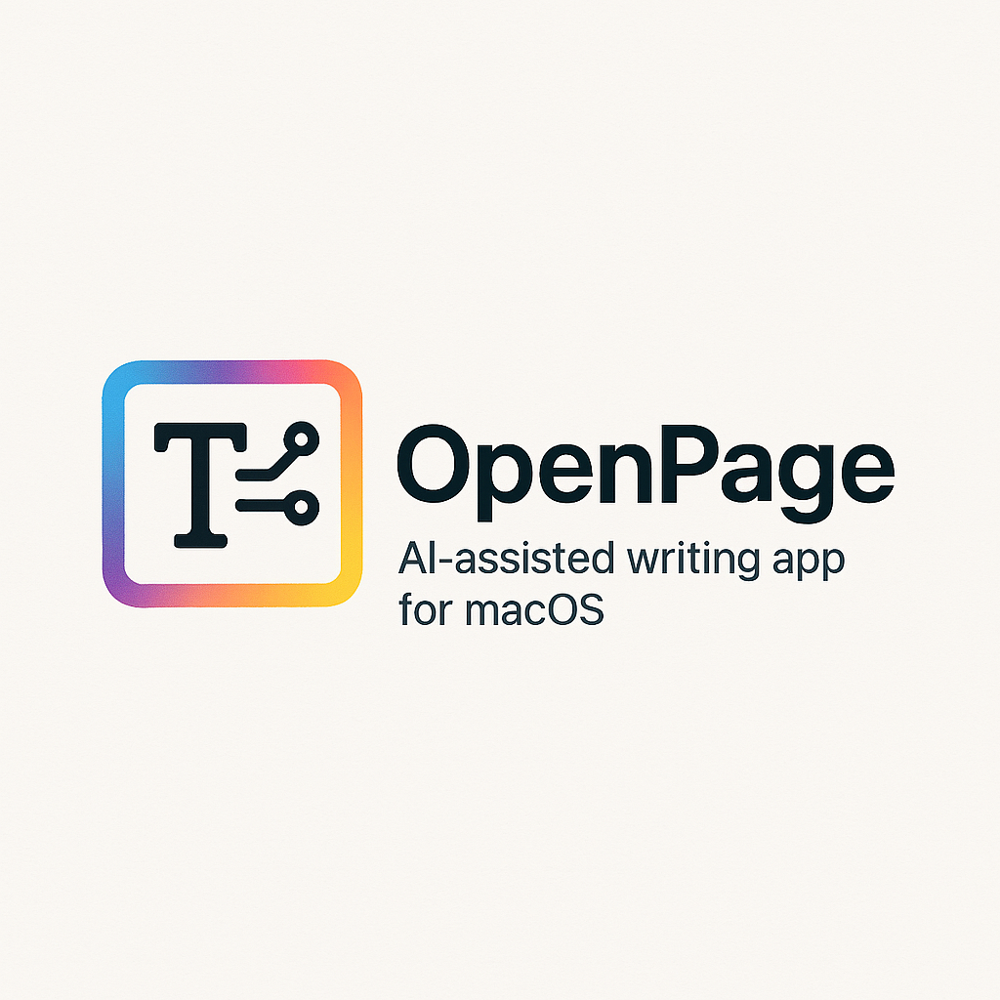

<div align="center">
  
  
  # OpenPage
  
  A modern, AI-powered document editor and writing application for macOS, built with SwiftUI and SwiftData.
  
  [](https://developer.apple.com/macos/)
  [](https://swift.org/)
  [](https://developer.apple.com/swiftui/)
  [](LICENSE)
</div>

## Features

### 📝 Advanced Document Management
- **Hierarchical Structure**: Create complex documents with nested sections and chapters
- **Project Organization**: Group related documents into projects for better workflow management
- **Version Tracking**: Automatic document versioning with snapshot history
- **Auto-Save**: Configurable auto-save functionality to prevent data loss

### 🤖 AI-Powered Writing Assistant
- **Multi-Provider Support**: Integrated support for Claude, OpenAI, and Gemini AI services
- **Task-Specific Routing**: Automatic AI provider selection based on writing task type
- **Writing Tasks**: 
  - Creative writing assistance
  - Technical documentation support
  - Content analysis and feedback
  - Brainstorming and idea generation
  - Editing and proofreading
  - Research assistance

### 🎨 Modern Writing Interface
- **Panel-Based Layout**: Customizable interface with binder, editor, and inspector panels
- **Focus Modes**: 
  - Normal: Full-featured editing
  - Typewriter: Centered line focus
  - Zen: Minimal, distraction-free environment
  - Distraction-Free: Hide all panels
- **Responsive Design**: Adaptive layout that works across different screen sizes

### 📊 Writing Analytics
- **Word Count Tracking**: Real-time word and character counts
- **Writing Goals**: Set and track daily word count targets
- **Progress Monitoring**: Visual progress indicators for writing objectives
- **Writing Streaks**: Track daily writing consistency

## Requirements

- macOS 14.0 or later
- Xcode 15.0 or later (for development)
- API keys for AI services (optional, for AI features)

## Installation

### For Users
1. Download the latest release from the [Releases](../../releases) page
2. Drag OpenPage.app to your Applications folder
3. Launch the application
4. Configure AI providers in Settings (optional)

### For Developers
1. Clone the repository:
   ```bash
   git clone https://github.com/your-username/OpenPage.git
   cd OpenPage
   ```

2. Open the project in Xcode:
   ```bash
   open OpenPage.xcodeproj
   ```

3. Build and run the project using `Cmd+R`

## Configuration

### AI Services Setup
To enable AI writing assistance, configure your API keys in the application settings:

1. Open OpenPage preferences (`Cmd+,`)
2. Navigate to the AI Settings tab
3. Enter your API keys for the desired providers:
   - **Claude**: Anthropic API key
   - **OpenAI**: OpenAI API key  
   - **Gemini**: Google AI Studio API key

API keys are stored securely in the macOS Keychain.

## Usage

### Creating Documents
- **New Document**: `Cmd+N` or File → New Document
- **New Project**: `Cmd+Shift+N` or File → New Project
- **From Template**: Choose from built-in document templates

### AI Assistant
- **Quick Chat**: `Cmd+A` to toggle the AI assistant panel
- **New Conversation**: `Cmd+Shift+A` to start a fresh chat
- **Context-Aware**: The AI understands your current document context

### Focus Modes
- Access focus modes from the View menu or toolbar
- Switch between different writing environments based on your needs
- Customize panel visibility for optimal writing experience

### Keyboard Shortcuts
- `Cmd+N`: New Document
- `Cmd+Shift+N`: New Project
- `Cmd+A`: Toggle AI Assistant
- `Cmd+Shift+A`: New AI Chat
- `Cmd+,`: Preferences
- `Cmd+Shift+E`: Export Document

## Architecture

OpenPage is built using modern SwiftUI and SwiftData technologies:

- **SwiftUI**: Declarative user interface framework
- **SwiftData**: Core Data successor for data persistence
- **Combine**: Reactive programming for state management
- **Foundation**: Core Swift frameworks

### Key Components
- **Document Model**: Hierarchical document structure with sections
- **Project Management**: Organization system for related documents
- **AI Service Layer**: Abstracted AI provider integration
- **State Management**: Centralized app state using ObservableObject

## Contributing

We welcome contributions to OpenPage! Please see our [Contributing Guidelines](CONTRIBUTING.md) for details on:

- Code style and conventions
- Development workflow
- Submitting pull requests
- Reporting bugs and feature requests

### Development Setup
1. Fork the repository
2. Create a feature branch (`git checkout -b feature/amazing-feature`)
3. Make your changes
4. Run tests and ensure code builds
5. Commit your changes (`git commit -m 'Add amazing feature'`)
6. Push to the branch (`git push origin feature/amazing-feature`)
7. Open a Pull Request

## Privacy & Security

- **Data Privacy**: All documents are stored locally on your device
- **API Security**: AI API keys are stored securely in macOS Keychain
- **Sandboxing**: App runs in macOS sandbox for enhanced security
- **No Telemetry**: No usage data is collected or transmitted

## License

This project is licensed under the MIT License - see the [LICENSE](LICENSE) file for details.

## Acknowledgments

- Built with Apple's SwiftUI and SwiftData frameworks
- AI integration powered by Anthropic Claude, OpenAI, and Google Gemini
- Icons and design inspired by macOS Human Interface Guidelines

## Support

- **Documentation**: Check the in-app help system
- **Issues**: Report bugs via [GitHub Issues](../../issues)
- **Discussions**: Join the community in [GitHub Discussions](../../discussions)

---

**OpenPage** - Empowering writers with AI-assisted creativity and organization.